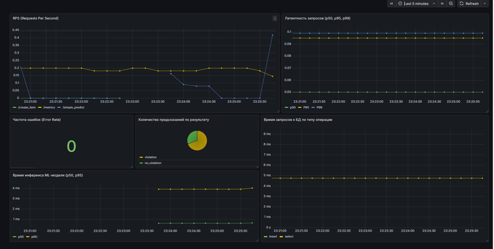

Видео mlflow
https://disk.360.yandex.ru/i/QR1xNEZDEX3oVg

Отчет в графане 



Установка зависимостей:
```bash
pip install -r requirements.txt
```

Инфра 
```bash
docker-compose up -d
```


Запуск основного апи
В новом окне терминала:

```
python main.py
```

В еще одном окне терминала:

```
$env:PYTHONPATH="."; python -m workers.moderation_worker
```
